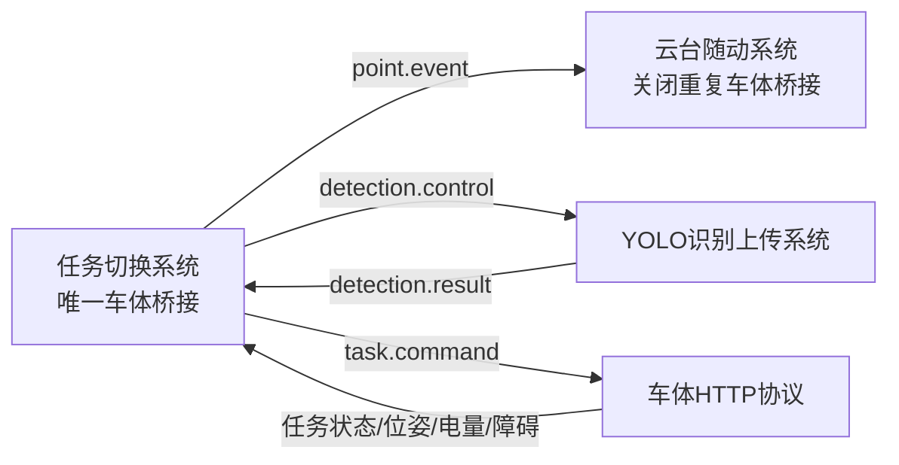

# 独立系统目录

| 目录 | 单独启动 | 组合方式 |
|---|---|---|
| task_switch_system | `bash task_switch_system/run.sh` | 加 `enable_yolo:=true` 接收独立YOLO结果 |
| ptz_follow_system | `bash ptz_follow_system/run.sh` | 已有任务模块车体桥接时加 `enable_robot_bridge:=false` |
| yolo_upload_system | `bash yolo_upload_system/run.sh rknn` | 任务模块需加 `enable_yolo:=true` |
| full_system | `bash full_system/run_rknn.sh` | 调用原一键启动，原脚本不变 |

从项目根目录组合启动时，建议分三个终端按以下顺序运行，使YOLO桥和云台先就绪：

```bash
bash independent_systems/yolo_upload_system/run.sh rknn
bash independent_systems/ptz_follow_system/run.sh enable_robot_bridge:=false
bash independent_systems/task_switch_system/run.sh enable_yolo:=true
```

完整实测优先使用 `full_system`；三个独立模块主要用于逐模块测试和故障定位。不要同时运行完整系统和独立模块，避免ROS节点名、车体命令和ZMQ端口重复。


