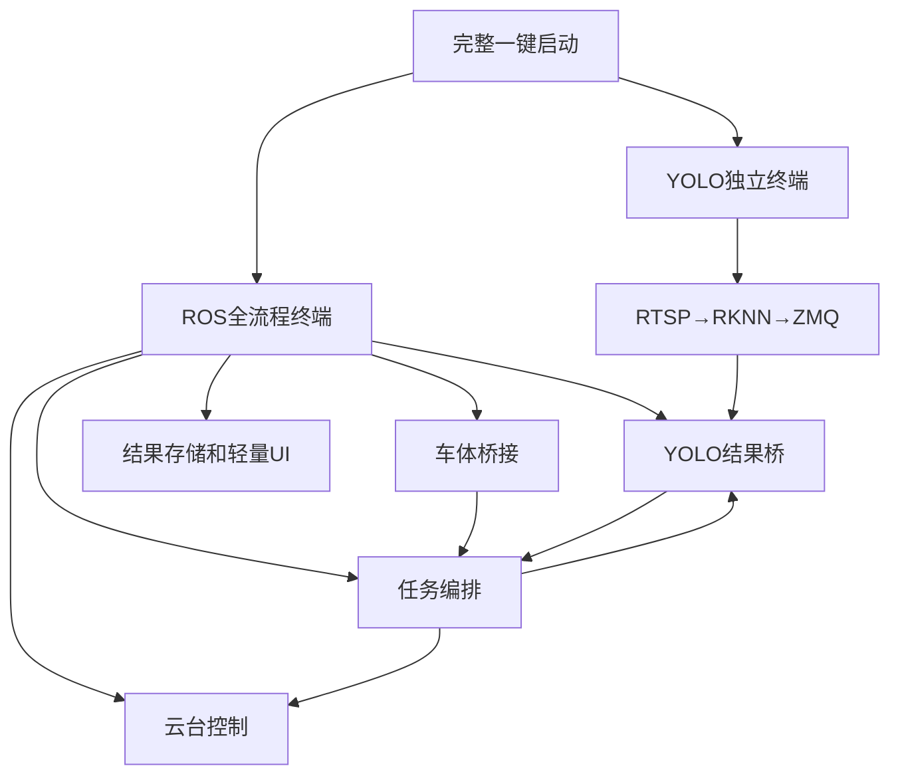

# 完整一键启动入口

本目录不复制、不修改原一键启动逻辑，只调用项目根目录原脚本，因此原有启动方式保持不变。

```bash
bash independent_systems/full_system/run_yolov8.sh
bash independent_systems/full_system/run_rknn.sh
```


```mermaid
flowchart TD
  A["完整一键启动"] --> B["YOLO独立终端"]
  A --> C["ROS全流程终端"]
  B --> D["RTSP→RKNN→ZMQ"]
  C --> E["车体桥接"]
  C --> F["任务编排"]
  C --> G["云台控制"]
  C --> H["YOLO结果桥"]
  C --> I["结果存储和轻量UI"]
  D --> H
  E --> F
  F --> G
  F --> H
  H --> F
```
