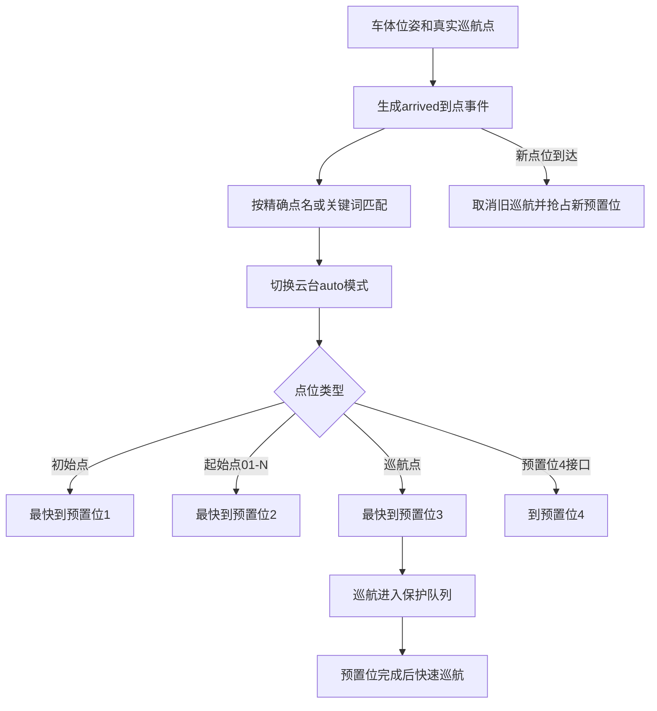

# 云台随动独立系统

默认自带车体桥接，根据真实位姿产生到点事件：

```bash
bash independent_systems/ptz_follow_system/run.sh
```

与任务切换模块一起运行时，关闭本模块的重复车体桥接：

```bash
bash independent_systems/ptz_follow_system/run.sh enable_robot_bridge:=false
```

规则位于 `config/ptz_points.yaml`：初始点→预置位1，起始点01-N→预置位2，巡航点→预置位3并巡航，预置位4保留接口。新固定点会取消旧巡航；巡航在预置位动作完成后执行。


