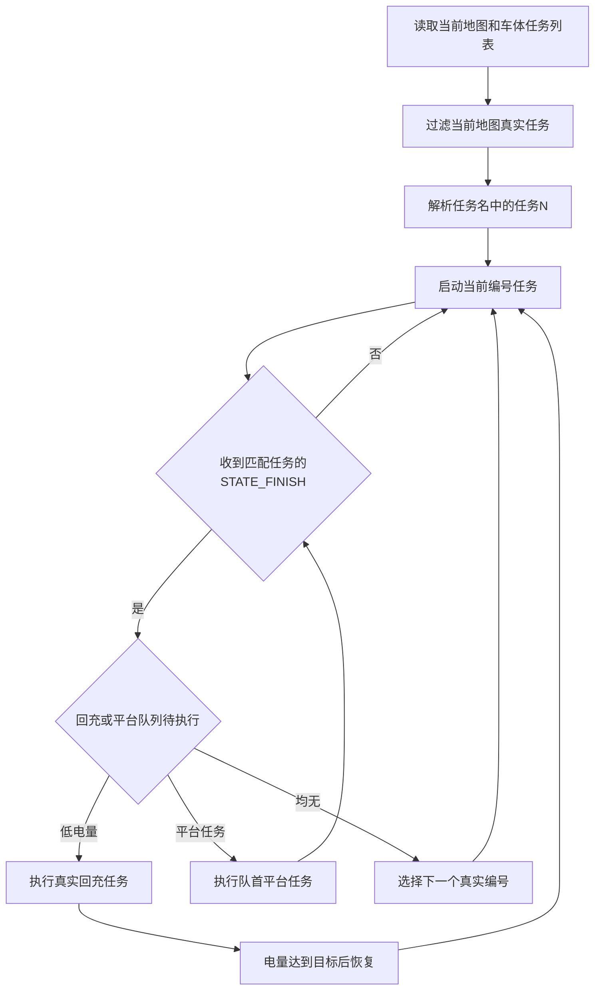

# 任务切换独立系统

只负责车体HTTP桥接、当前地图任务过滤、编号任务循环、回充、障碍和轻量UI。默认不依赖云台和YOLO。

```bash
bash independent_systems/task_switch_system/run.sh
```

与独立YOLO组合时：

```bash
bash independent_systems/task_switch_system/run.sh enable_yolo:=true
```

任务名必须包含“任务N”，例如“西任务1台位”。当前地图有任务1、2、3时按 1→2→3→1 循环；若没有任务1，末尾回到最小真实编号。


