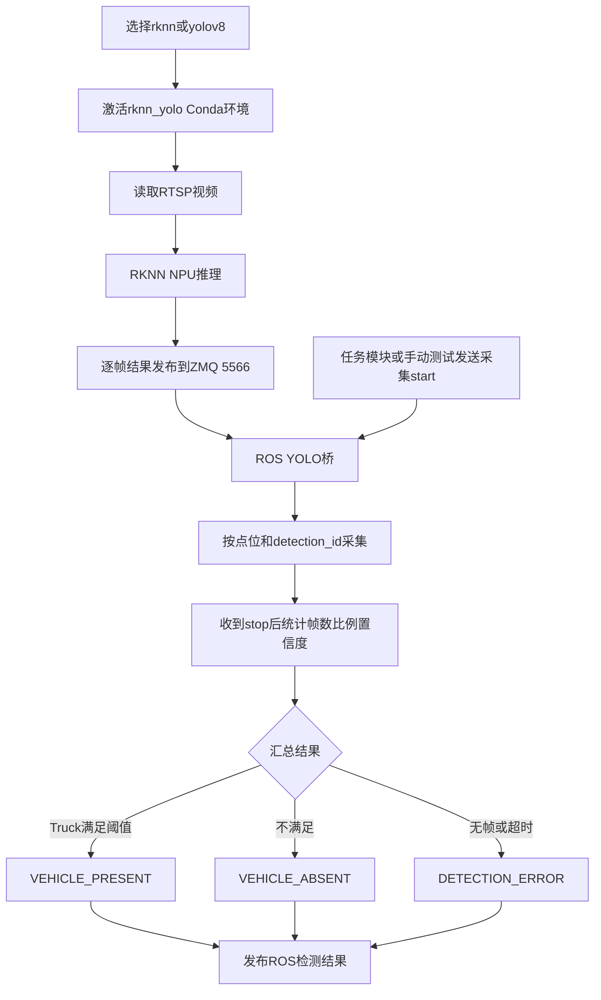

# YOLO识别与结果上传独立系统

截图上报入口现已改为根目录单图上传，携带任务名称、识别结果 `result`、截图时间戳、最近经过的巡航点原名称和机器人编码；进入20秒等待步骤时沿用前一巡航点，不因点位信息缺失阻塞截图。详见 [单图上传说明](SNAPSHOT_UPLOAD.md)。

默认使用目录内已有的 `best_truck.rknn`：

```bash
bash independent_systems/yolo_upload_system/run.sh rknn
```

把YOLOv8模型放入 `detector/models/yolov8n.rknn` 后：

```bash
bash independent_systems/yolo_upload_system/run.sh yolov8
```

单独验证一次起始点Truck采集（另开终端）：

```bash
bash independent_systems/yolo_upload_system/manual_test.sh --point 起始点01 --seconds 6
```

检测程序持续读取RTSP并通过ZMQ上传结构化帧；ROS桥只在收到采集控制后汇总并发布“有车/无车/错误”结果，不向UI传视频。


